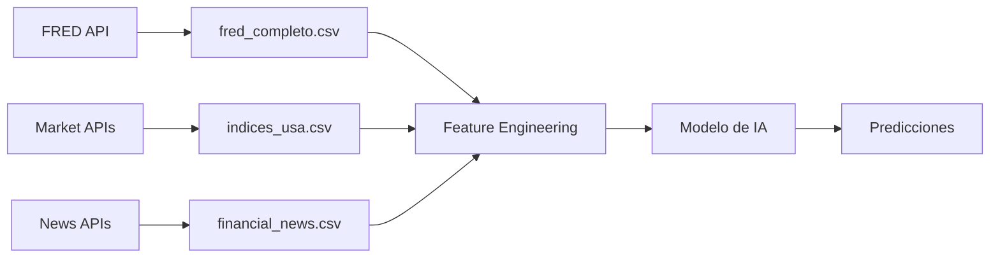

# 📊 Estructura de Datos - Bot Predictivo de Noticias

## 🎯 Objetivo del Proyecto

Entrenar una IA que prediga **qué noticias económicas afectan más al mercado de valores de Estados Unidos**.

---

## 📁 Estructura de Directorios

```
data/
├── raw/                    # Datos crudos sin procesar
│   ├── fred/              # Datos económicos de FRED
│   ├── market/            # Datos de mercado (precios, volumen)
│   └── news/              # Noticias financieras (próximo paso)
│
├── processed/             # Datos procesados y limpios
│   ├── fred/              # Series económicas procesadas
│   │   ├── fred_completo_YYYYMMDD.csv
│   │   ├── fred_diario_YYYYMMDD.csv
│   │   ├── fred_alto_impacto_YYYYMMDD.csv
│   │   ├── indicadores_economicos_usa_YYYYMMDD.csv
│   │   ├── mercados_financieros_YYYYMMDD.csv
│   │   ├── tipos_cambio_real_YYYYMMDD.csv
│   │   ├── tipos_cambio_spot_YYYYMMDD.csv
│   │   └── metadata_YYYYMMDD.json
│   │
│   ├── market/            # Datos de mercado procesados
│   └── features/          # Features para ML
│
└── models/                # Modelos entrenados
    ├── lstm_news_impact.h5
    ├── bert_sentiment.pkl
    └── ensemble_predictor.pkl
```

---

## 📋 Datasets Generados

### 1. **fred_completo_YYYYMMDD.csv**
**Descripción:** Todas las series económicas y financieras combinadas.

**Columnas:**
- `GDPC1`: PIB Real USA
- `UNRATE`: Tasa de Desempleo
- `CPIAUCSL`: Índice de Precios al Consumidor (inflación)
- `VIXCLS`: Índice de Volatilidad VIX
- `DGS10`: Rendimiento Tesoro 10 años
- `RBXMBIS`: Tipo Cambio Real - Área Euro
- `RBJPBIS`: Tipo Cambio Real - Japón
- `RBHKBIS`: Tipo Cambio Real - Hong Kong
- `RBAUBIS`: Tipo Cambio Real - Australia
- `RBCNBIS`: Tipo Cambio Real - China
- `DEXUSEU`: Tipo Cambio Spot USD/EUR
- `RTWEXBGS`: Índice Real Amplio del Dólar

**Uso:** Dataset principal para análisis de correlaciones y entrenamiento.

---

### 2. **fred_diario_YYYYMMDD.csv**
**Descripción:** Solo series con frecuencia diaria (más granular).

**Series incluidas:**
- `VIXCLS`: VIX (volatilidad)
- `DGS10`: Rendimiento Tesoro
- `DEXUSEU`: USD/EUR
- `RTWEXBGS`: Índice del Dólar

**Uso:** Para análisis de impacto inmediato de noticias (mismo día).

---

### 3. **fred_alto_impacto_YYYYMMDD.csv**
**Descripción:** Solo indicadores marcados como "ALTO IMPACTO".

**Series incluidas:**
- PIB Real
- Tasa de Desempleo
- CPI (inflación)
- VIX
- Rendimiento Tesoro 10 años
- Tipo Cambio Real China
- Índice del Dólar

**Uso:** Para entrenar modelo enfocado en noticias de mayor impacto.

---

### 4. **Datasets por Categoría**

#### a) **indicadores_economicos_usa_YYYYMMDD.csv**
Indicadores macroeconómicos principales:
- PIB, Desempleo, Inflación

#### b) **mercados_financieros_YYYYMMDD.csv**
Indicadores de mercados:
- VIX, Rendimiento Tesoro

#### c) **tipos_cambio_real_YYYYMMDD.csv**
Tipos de cambio ajustados por inflación:
- Euro, Japón, Hong Kong, Australia, China

#### d) **tipos_cambio_spot_YYYYMMDD.csv**
Tipos de cambio actuales:
- USD/EUR, Índice del Dólar

---

### 5. **metadata_YYYYMMDD.json**
**Descripción:** Información detallada de cada serie.

**Contenido para cada serie:**
```json
{
  "UNRATE": {
    "nombre": "Tasa de Desempleo",
    "unidad": "Porcentaje",
    "frecuencia": "Mensual",
    "impacto": "ALTO - Impacta decisiones de Fed y mercados",
    "observaciones": 300,
    "fecha_inicio": "2000-01-01",
    "fecha_fin": "2025-11-01",
    "ultimo_valor": 4.3,
    "valores_faltantes": 0
  }
}
```

---

## 🎯 Uso para Entrenamiento de IA

### Fase 1: Datos Económicos (Actual) ✅
```python
# Cargar datos económicos
df_economico = pd.read_csv('data/processed/fred/fred_completo_YYYYMMDD.csv')
df_alto_impacto = pd.read_csv('data/processed/fred/fred_alto_impacto_YYYYMMDD.csv')
```

### Fase 2: Datos de Mercado (Siguiente)
```python
# Cargar datos de S&P 500, DOW, NASDAQ
df_market = pd.read_csv('data/processed/market/indices_usa_YYYYMMDD.csv')
```

### Fase 3: Datos de Noticias (Futuro)
```python
# Scraping de noticias con timestamps
df_news = pd.read_csv('data/processed/news/financial_news_YYYYMMDD.csv')
# Columnas: date, headline, source, sentiment, category
```

### Fase 4: Correlacionar Todo
```python
# Merge por fechas
df_completo = pd.merge(df_economico, df_market, on='date')
df_completo = pd.merge(df_completo, df_news, on='date')

# Feature Engineering
# Calcular cambios porcentuales después de cada noticia
# Clasificar impacto: ALTO, MEDIO, BAJO
```

---

## 📊 Niveles de Impacto

### **ALTO IMPACTO** 🔴
Noticias que históricamente causan movimientos >2% en mercados:
- Decisiones de tasas de interés de la Fed
- Reportes de empleo (NFP)
- Datos de inflación (CPI, PCE)
- Datos de PIB
- Crisis geopolíticas

### **MEDIO IMPACTO** 🟡
Movimientos 0.5%-2%:
- Ventas minoristas
- Producción industrial
- Confianza del consumidor
- Balanza comercial

### **BAJO IMPACTO** 🟢
Movimientos <0.5%:
- Datos de construcción
- Solicitudes de hipotecas
- Noticias corporativas individuales

---

## 🔄 Flujo de Actualización



---

## 📝 Próximos Pasos

1. ✅ **Datos económicos obtenidos** (fred_collector_completo.py)
2. ⏳ **Obtener datos de mercado** (SPY, DIA, QQQ, VIX)
3. ⏳ **Recolectar noticias históricas**
4. ⏳ **Feature engineering avanzado**
5. ⏳ **Entrenar modelo LSTM + BERT**
6. ⏳ **Backtesting y validación**
7. ⏳ **Despliegue en producción**

---

## 🛠️ Herramientas

- **Datos económicos:** FRED API
- **Datos de mercado:** yfinance, Alpha Vantage
- **Noticias:** News API, BeautifulSoup (scraping)
- **Análisis de sentimiento:** FinBERT, VADER
- **Modelos:** LSTM (TensorFlow), Transformers (Hugging Face)
- **Visualización:** Plotly, Matplotlib

---

## 📖 Referencias

- FRED: https://fred.stlouisfed.org/
- NBER: https://www.nber.org/
- Fed Speeches: https://www.federalreserve.gov/newsevents/speeches.htm
- Bloomberg: Market moving news
- Reuters: Financial news wire

---

**Última actualización:** 2025-11-07
**Autor:** Bot Predictivo de Noticias - Equipo IA


